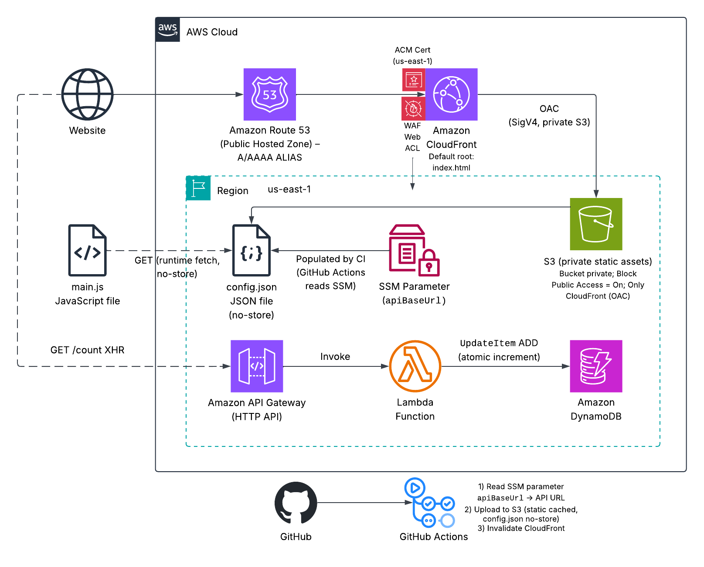
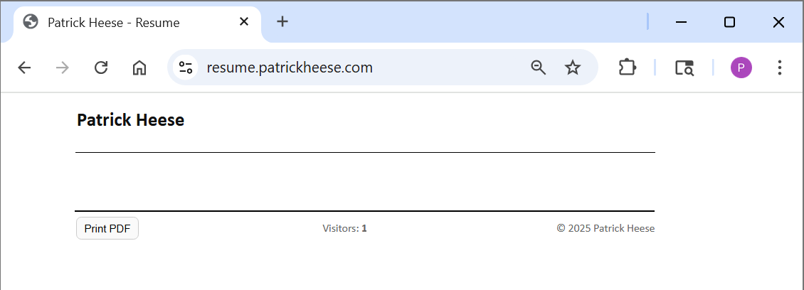

# AWS Cloud Resume Challenge  
Global, HTTPS resume on CloudFront + API/DynamoDB; signals: 100% IaC, keyless CI/CD (OIDC), least-privilege IAM.  

A **static resume website** on **CloudFront + S3 (private via OAC)** with a **serverless visitor counter** powered by **API Gateway (HTTP API)** → **Lambda (Python)** → **DynamoDB**. The project uses **Terraform** for infrastructure, **GitHub Actions (OIDC)** for CI/CD, and a runtime `config.json` (served **no-store**) to decouple the API URL from the site build.  

> Live site: https://resume.patrickheese.com  

[](https://github.com/patrick-heese/aws-cloud-resume-challenge/actions/workflows/infra-ci.yml)  
[](https://github.com/patrick-heese/aws-cloud-resume-challenge/actions/workflows/frontend-deploy.yml)  

## Architecture Overview  
  
*Figure 1: CloudFront serves a private S3 bucket via OAC; `main.js` fetches `config.json` (no-store) to discover the API URL, then calls `GET /count` on API Gateway → Lambda → DynamoDB. ACM (us-east-1) and WAF are attached to CloudFront; CI writes `config.json` from SSM and invalidates CloudFront.*  

### Core Components
- **Route 53 (Public Hosted Zone)** - A/AAAA ALIAS to CloudFront.  
- **CloudFront (Primary) + WAFv2 + ACM (us-east-1)** – TLS termination, caching, and edge protection.  
- **S3 (private)** – Website assets (`index.html`, `styles.css`, `main.js`, `config.json`, `favicon.ico`). **Block Public Access: ON**. CF→S3 authorized by **OAC (SigV4)**.  
- **Runtime config** – Browser **GET (runtime fetch)** of `config.json` (served with **Cache-Control: no-store**).  
- **Counter API** – API Gateway (**HTTP API**) with route `GET /count` → **Lambda (Python 3.12)** → **DynamoDB** (`pk = SITE_ID`, `count`). Lambda uses `UpdateItem` ADD for atomic increments.  
- **SSM Parameter** – Stores the API base URL (read by CI to generate `config.json`).  
- **GitHub Actions (OIDC)** – One workflow for **infra** (tests → plan/apply), one workflow for **frontend** (build → S3 sync → CF invalidation).  

## Skills Applied  
- Designing reproducible AWS infrastructure with **Terraform** (CloudFront + OAC, private S3 origin, API Gateway, Lambda, DynamoDB, WAF).  
- Implementing a **serverless** counter path (API Gateway → Lambda → DynamoDB) using DynamoDB `UpdateItem` ADD for atomic increments.  
- Orchestrating CI/CD with **GitHub Actions (OIDC)**, **automating** infrastructure and frontend deployments via least-privilege roles.  
- Decoupling the frontend from the backend by serving a runtime `config.json` (**no-store**) and **constraining** CORS to the custom domain.  
- Hardening edge delivery with **ACM TLS (us-east-1)**, **WAF managed rule groups**, and **rate limiting**.  

## Features  
- **Private S3 origin via OAC** – Bucket is private with Block Public Access; CloudFront uses Origin Access Control (SigV4) to fetch objects.  
- **Live visitor counter** – API Gateway (HTTP API) → Lambda (Python 3.12) → DynamoDB uses `UpdateItem` ADD to atomically increment on each page view.  
- **Runtime configuration** – `config.json` served with `Cache-Control: no-store` lets the frontend discover the API URL at runtime without rebuilds.  
- **CI/CD: infra** – `infra-ci.yml` runs unit tests, Terraform fmt/validate/plan (no refresh), and applies on `main` via GitHub OIDC.  
- **CI/CD: frontend** – `frontend-deploy.yml` builds the site, writes `config.json` from SSM, syncs to S3 with cache headers, and invalidates CloudFront.  
- **Edge security** – CloudFront uses ACM TLS (us-east-1) and AWS WAF (managed rule groups with optional rate limiting).  
- **CORS hardening** – API Gateway allows only the custom resume domain once DNS is live (CloudFront domain removed after cutover).  
- **Testing & quality** – Unit tests with `pytest` + `moto`; consistent repo structure and status badges for quick verification.  

## Tech Stack  
- **Languages:** HTML, CSS, JavaScript, Python  
- **AWS Services:** Route 53, CloudFront, WAF, ACM (us-east-1), S3 (private + OAC), API Gateway (HTTP API), Lambda, DynamoDB, SSM Parameter Store  
- **IaC Tool:** Terraform  
- **CI/CD:** GitHub Actions (OIDC)  
- **Other Tools:** AWS CLI  

## Deployment Instructions  
> **Note:** Many commands are identical across shells; the main differences are line continuation (PowerShell: `` ` `` • Bash: `\` • cmd.exe: `^`), environment variables (PowerShell: `$env:NAME=...` • Bash: `NAME=...` • cmd.exe: `set NAME=...`), and path separators.  

1. To deploy all the infrastructure, a registered domain/subdomain in Route 53 is needed (e.g., `firstnamelastname.com` / `resume.firstnamelastname.com`). Terraform can create and auto-validate an **ACM certificate in us-east-1 (required for CloudFront)** via Route 53 DNS validation.  

### Terraform  
2. Clone this repository.  

3. Edit variables in `terraform.tfvars` and/or `variables.tf` to customize the deployment.  

4. Navigate to the `terraform` folder and deploy:  
    ```bash
    cd terraform
    terraform init
    terraform plan # Optional, but recommended.
    terraform apply
    ```

5. Replace the `index.html` and `styles.css` files with your HTML resume and associated stylesheets.  

6. *(Optional)* Run `test_handler.py` locally to test the Lambda visitor counter. The **infra-ci** GitHub Action runs these tests on every push to `main`. If tests fail, Terraform is not applied:  
    ```bash
	cd ../src/tests
	python -m venv .venv
    .\.venv\Scripts\Activate.ps1
	pip install -r requirements-dev.txt
	pytest -q
	```

7. To set up GitHub Actions, commit and push the repo to GitHub (`main`). Ensure your AWS account has a GitHub **OIDC provider**. Create two IAM roles and paste their ARNs into `.github/workflows/infra-ci.yml` and `.github/workflows/frontend-deploy.yml`:  
    - `GitHubOIDC-Infra` (plan/apply): Trust = GitHub OIDC with `sub` restricted to your repo/branch. Permissions = start broad while iterating (e.g., `AdministratorAccess`), then narrow to ACM, APIGWv2, CloudFront, DynamoDB, IAM (Lambda attach), Lambda, Logs, Route 53, S3, SSM, WAFv2 plus S3/DynamoDB permissions for the Terraform **backend** (if used). See [aws-iac-quality-gate](https://github.com/patrick-heese/aws-iac-quality-gate) for referenced workflow.
    - `GitHubOIDC-Frontend` (site deploy): Trust = your repo/branch. Permissions (least-privilege):  
        - `ssm:GetParameter` on your parameter  
		- `s3:ListBucket` on the site bucket  
		- `s3:PutObject`, `s3:DeleteObject`, `s3:PutObjectAcl` on `arn:aws:s3:::<bucket>/*`  
		- `cloudfront:CreateInvalidation`, `cloudfront:GetDistribution`, `cloudfront:ListDistributions`  

8. Tighten CORS post-deployment. During initial testing, you may allow the CloudFront domain. After the site is live on your custom DNS, lock CORS to the DNS only by setting:  
    ```hcl
    include_cloudfront_origin = false
    ```
    
	Then:  
	```bash
	terraform apply
	```
	
**Note:** Ensure the AWS CLI user (`aws configure`) or Terraform assumed role has sufficient permissions to manage **ACM**, **API Gateway**, **CloudFront**, **DynamoDB**, **Lambda**, **Route 53**, **S3**, **SSM**, **WAF**, and **IAM resources** (attach Lambda role).  

## How to Use  
1. **Deploy the infrastructure** using Terraform.  

2. Open the site at `https://resume.firstnamelastname.com`.  

3. Refresh the page to see the **Visitors** count in the footer increment (API → Lambda → DynamoDB).  

4. Check DynamoDB → Table → **Explore table items** (e.g., `pk = patrick-site`) to see the `count` value change.  

## Project Structure  
```plaintext
aws-cloud-resume-challenge
├── .github/                             
│   └── workflows/                       
│       ├── frontend-deploy.yml          # Build → S3 sync → CF invalidate (OIDC)
│       └── infra-ci.yml                 # Caller workflow → reusable IaC Gate
├── assets/
│   ├── architecture-diagram.png         # Architecture diagram
│   ├── site-demo.png                    # Resume footer + counter; PII redacted
│   └── ddb-counter.png                  # DynamoDB item view (pk,count)
├── frontend/                            # Website files
│   ├── config.json                      # (written by CI at deploy; served no-store)
│   ├── favicon.ico                      
│   ├── index.html                       
│   ├── main.js                          # Fetches config.json + GET /count
│   └── styles.css                       
├── terraform/                           # Terraform templates
│   ├── main.tf                          # Main Terraform config
│   ├── variables.tf                     # Input variables
│   ├── outputs.tf                       # Exported values
│   ├── terraform.tfvars                 # Default variable values
│   ├── providers.tf                     # AWS provider definition
│   ├── versions.tf                      # Terraform version constraint
│   └── backend.tf                       # Remote state: S3 backend + DynamoDB lock (shared by Local & CI)
├── src                                  # Lambda source code and tests
│   ├── count_function/                  
│   │   └── count_lambda.py              # Lambda handler (atomic UpdateItem ADD)
│   └── tests/                           
│       ├── requirements-dev.txt         # boto3, moto, pytest
│       └── test_handler.py              # Unit tests (moto @mock_aws)
├── LICENSE                              
├── README.md                            
└── .gitignore                           
```

## Screenshots  
  
*Figure 2: Redacted resume website showing footer visitor counter.*  

  
*Figure 3: DynamoDB table showing an incrementing count attribute.*  

> Live site: https://resume.patrickheese.com  

## Future Enhancements   
- **WAF logging:** S3 via Kinesis Firehose; add custom rules (bot control, geo).  
- **Observability:** CloudWatch Dashboards for API latency, Lambda errors, DynamoDB throttle/write metrics.  
- **Custom domain hardening:** Enforce HSTS, add Security Headers (CF response headers policy).  
- **Multi-environment:** Dev/Stage/Prod with distinct SITE_IDs and CORS origins.  
- **Blue/green deployment:** Lambda deploys via aliases and canary traffic (API Gateway stage variables).  

## License  
This project is licensed under the [MIT License](LICENSE).  

---

## Author  
**Patrick Heese**  
Cloud Administrator | Aspiring Cloud Engineer/Architect  
[LinkedIn Profile](https://www.linkedin.com/in/patrick-heese/) | [GitHub Profile](https://github.com/patrick-heese)  

## Acknowledgments  
This project was inspired by the [The Cloud Resume Challenge - AWS](https://cloudresumechallenge.dev/docs/the-challenge/aws).  
The architecture diagram included here is my own version.  
I designed and developed all Infrastructure as Code (Terraform), Lambda/Python code, GitHub Actions (OIDC) workflows, and project documentation.  
